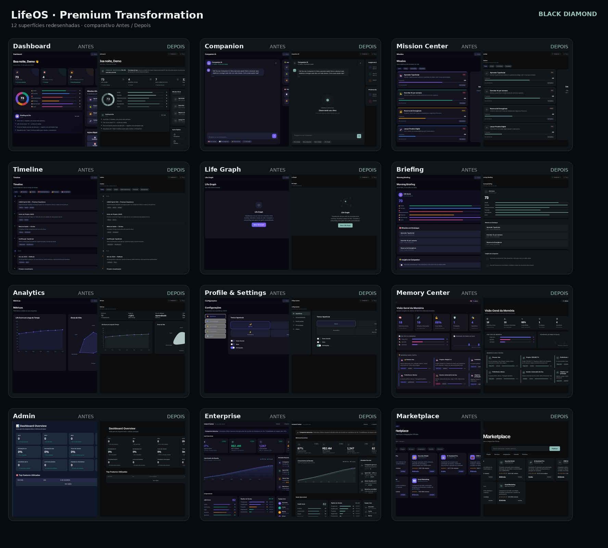

# LifeOS — Premium Transformation

## Operation Black Diamond

**Autor:** Manus AI  
**Status:** concluído  
**Data de conclusão:** 10 de julho de 2026

> **Diretriz central:** elevar todas as superfícies existentes sem criar telas, módulos ou funcionalidades. O produto deve transmitir luxo, tecnologia, calma, precisão, minimalismo e elegância.

## 1. Resultado executivo

A Operation Black Diamond substituiu a aparência fragmentada de MVP por uma linguagem de produto única. A aplicação principal, o Memory Center, o Admin Dashboard, o Enterprise Command Center e o Marketplace agora compartilham tokens, tipografia, grid, iconografia, componentes, estados e comportamento responsivo.

A transformação preservou os fluxos e dados existentes. Nenhuma tela ou módulo foi criado. O trabalho concentrou-se em hierarquia, densidade, sistema visual, Companion, gráficos, estados vazios, acessibilidade, responsividade e motion.

| Objetivo | Resultado |
| --- | --- |
| Remover aparência de MVP, template e dashboard genérico | **Concluído** |
| Unificar todas as superfícies existentes | **Concluído** |
| Tornar o Companion o centro visual | **Concluído** |
| Criar visual executivo e gráficos profissionais | **Concluído** |
| Eliminar emojis como iconografia | **Concluído** |
| Reduzir gradientes, neon e efeitos chamativos | **Concluído** |
| Preservar escopo funcional | **Concluído** |
| Validar desktop, tablet e mobile | **Concluído** |
| Produzir documentação e comparativos | **Concluído** |

## 2. Fundamentos

A implementação traduz as recomendações da Apple sobre clareza, familiaridade, flexibilidade, simplicidade, craft, tipografia, layout adaptativo e movimento intencional.[1] [2] [3] [4] Linear contribuiu com foco operacional e redução de ruído; Geist/Vercel, com disciplina de fundações; Raycast, com ações compactas; Stripe, com arquitetura de dashboards; Figma, com hierarquia, consistência, contraste e alinhamento.[5] [6] [7] [8] [9]

Notion, Arc e Perplexity orientaram a presença contextual da IA: integrada ao trabalho, calma, consciente do contexto e com estado legível, sem aparência de chatbot isolado.[10] [11] [12]

## 3. Diagnóstico anterior

O produto já possuía cobertura funcional relevante, mas dependia de roxo saturado, gradientes, emojis, halos, raios excessivos e cartões repetitivos. As superfícies independentes utilizavam linguagens diferentes, comprometendo continuidade e confiança. Havia espaço ocioso em Life Graph, Analytics e Settings; excesso cromático em Dashboard, Briefing, Missões e Enterprise; estados vazios fracos no Admin; e estética de catálogo genérico no Marketplace.

A auditoria detalhada do estado original está registrada em [`audit/BEFORE_VISUAL_AUDIT.md`](audit/BEFORE_VISUAL_AUDIT.md).

## 4. Direção visual

A linguagem implementada é **quiet luxury digital**: grafite mineral, superfícies discretamente elevadas, texto marfim frio, cinzas azulados e um acento azul-petróleo usado apenas em foco, seleção, progresso e presença da IA.

| Papel | Token | Intenção |
| --- | --- | --- |
| Base | `#0B0D0F` | Profundidade neutra, sem preto absoluto |
| Sidebar | `#0E1114` | Contexto persistente e discreto |
| Surface 1 | `#12161A` | Seções primárias |
| Surface 2 | `#171C21` | Hover, agrupamento e controles |
| Texto principal | `#F0F2EF` | Marfim frio e confortável |
| Texto secundário | `#A0A8AD` | Informação de suporte |
| Acento | `#6FA6A0` | Tecnologia calma, seleção e progresso |
| Sucesso | `#78A98C` | Estado positivo dessaturado |
| Atenção | `#C2A46F` | Prioridade sem estridência |
| Perigo | `#C77D78` | Erro e ação destrutiva controlados |

Gradientes ornamentais, halos, glow pulsante, arco-íris analítico e superfícies translúcidas excessivas foram neutralizados. A separação estrutural vem de tipografia, espaçamento, luminância e bordas.

## 5. Tipografia, grid e densidade

A pilha tipográfica usa Inter com fallbacks de sistema, pesos 400, 500, 600 e 700 e números tabulares para métricas, horários, scores e códigos. Títulos usam tracking negativo discreto; rótulos mantêm caixa natural.

O sistema adota escala base de 4 px, com ritmo principal de 8, 12, 16, 20, 24, 32 e 40 px. A composição desktop utiliza sidebar persistente e conteúdo fluido; tablet e mobile reorganizam grids, cabeçalhos, busca e painéis sem esconder informação essencial.

| Elemento | Tratamento final |
| --- | --- |
| Sidebar | Navegação compacta, fundo explícito, ícones SVG e perfil operacional |
| Header | Título contextual, busca e ações discretas |
| Cards | Raios menores, bordas sutis, sombra mínima e papéis distintos |
| Tabelas | Linhas compactas, números alinhados e estados vazios contidos |
| Gráficos | Escala tonal, eixos discretos, números tabulares e contexto adjacente |
| Formulários | Superfície integrada, foco mineral e feedback próximo ao controle |
| Estados vazios | Estrutura, explicação e próxima ação sem conteúdo simulado |

## 6. Arquitetura de implementação

A transformação foi aplicada como uma camada compartilhada sobre as superfícies existentes. Isso reduz divergência, mantém o código funcional original e torna o acabamento consistente.

| Arquivo | Responsabilidade |
| --- | --- |
| [`premium_ui/black_diamond.css`](premium_ui/black_diamond.css) | Tokens, fundações, componentes, adaptações por superfície, estados e responsividade |
| [`premium_ui/black_diamond.js`](premium_ui/black_diamond.js) | Iconografia SVG, Companion, resumos executivos, gráficos e aprimoramentos dinâmicos |
| [`premium_ui/index.html`](premium_ui/index.html) | Integração da camada na aplicação principal |
| [`premium_ui/memory_center.html`](premium_ui/memory_center.html) | Integração no Memory Center |
| [`premium_ui/beta/admin-dashboard.html`](premium_ui/beta/admin-dashboard.html) | Integração e correção da colisão de IDs em Beta Testers |
| [`premium_ui/enterprise/enterprise_premium.html`](premium_ui/enterprise/enterprise_premium.html) | Integração e nomes acessíveis dos controles iconográficos |
| [`ecosystem/marketplace/marketplace.html`](ecosystem/marketplace/marketplace.html) | Integração do catálogo ao sistema global |

A camada comportamental substitui emojis visuais por SVGs consistentes, recalibra instâncias dinâmicas de gráficos e preserva conteúdo textual. Um observador mantém a iconografia correta quando elementos são atualizados pela aplicação.

## 7. Companion

O Companion foi transformado em assinatura visual da plataforma. Um núcleo vetorial abstrato ocupa o estado inicial, com respiração de baixa amplitude, estado textual e mensagem contextual. A solução não usa rosto, mascote, emoji, neon ou gradiente infantil.

Chat, insights, próximas ações e controles existentes permanecem funcionais. O movimento é desativado quando `prefers-reduced-motion` está ativo, e o estado continua compreensível por texto e composição.

## 8. Dashboard e Analytics

O Dashboard foi reorganizado para leitura executiva. Life Score, indicadores, missões, briefing e ações rápidas utilizam hierarquia editorial e escala cromática unificada. Cores individuais por área ou missão foram convertidas para variações tonais, mantendo cores semânticas apenas onde há significado operacional.

Analytics preserva os gráficos existentes, recalibrados para a paleta Black Diamond, e apresenta uma faixa executiva derivada dos dados já exibidos. O primeiro viewport permite entender situação, tendência e prioridade antes de examinar detalhes.

## 9. Cobertura das superfícies

| Superfície existente | Transformação concluída |
| --- | --- |
| Dashboard | Hierarquia executiva, score, indicadores, missões, briefing e ações |
| Companion | Presença central, estado vivo e conversa integrada |
| Mission Center | Progresso, prioridade, lista e detalhe com densidade controlada |
| Timeline | Hierarquia temporal, filtros e marcadores discretos |
| Life Graph | Estado estrutural de rede sem simulação de dados |
| Briefing | Narrativa editorial e escala tonal |
| Analytics | Gráficos profissionais e síntese executiva |
| Profile & Settings | Categorias, controles, feedback, privacidade e sobre |
| Memory Center | Busca, indicadores, gráficos e memórias unificados |
| Admin | Overview, Usuários, Analytics, Beta Program, feedback e telemetria |
| Enterprise | Receita, atividade, saúde, pipeline e equipe com linguagem de comando |
| Marketplace | Busca, filtros, catálogo, confiança, preço e instalação |

O Perfil permanece representado pelo bloco de usuário existente e encaminha para Configurações. Não foi criada uma tela independente. A área Founder continua representada na superfície Enterprise existente; nenhuma interface nova foi adicionada.

## 10. Correções de qualidade

Durante a validação, foram identificadas e corrigidas regressões e falhas preexistentes. A sidebar recebia fundo nativo de `button` sob `color-scheme: dark`; a camada agora declara explicitamente o estado transparente. Memory Center e Marketplace apresentavam overflow em mobile; grades, cabeçalhos e busca foram adaptados. Beta Testers não abria devido a uma colisão de IDs; o indicador conflitante foi renomeado. Dois botões iconográficos do Enterprise receberam `aria-label` e `title`.

| Correção | Impacto |
| --- | --- |
| Fundo nativo da sidebar | Elimina blocos cinza e preserva hover/ativo |
| Overflow do Memory Center | Mantém indicadores e gráficos dentro do viewport |
| Overflow do Marketplace | Preserva busca e catálogo em mobile |
| Colisão de IDs no Admin | Restaura Beta Testers e seu estado vazio |
| Botões sem nome no Enterprise | Melhora navegação assistiva e elimina ressalva automatizada |
| Paleta dinâmica de gráficos | Mantém consistência após abertura tardia das telas |

## 11. Motion e acessibilidade

Transições utilizam principalmente `opacity` e `transform`, com curvas naturais e duração aproximada de 140–260 ms. Hovers são discretos; ações frequentes não aguardam animações; movimento nunca é o único canal de informação. Essa implementação segue a recomendação da Apple de usar motion com intenção e respeitar preferências de redução.[4]

Foco visível, contraste, estados ativos multimodais e nomes acessíveis foram preservados. A validação final não encontrou botões sem nome nas superfícies verificadas.

## 12. Validação automatizada

A suíte em [`audit/validate_black_diamond.js`](audit/validate_black_diamond.js) percorre a aplicação principal e as quatro superfícies independentes em desktop, tablet e mobile. O relatório integral está em [`audit/black_diamond_validation.json`](audit/black_diamond_validation.json).

| Evidência | Resultado |
| --- | --- |
| Verificações de superfície/viewport | **37** |
| Falhas finais | **0** |
| Overflow horizontal | **0** |
| Erros de console | **0** |
| Botões sem nome acessível | **0** |
| Falhas de carregamento do Design System | **0** |
| Capturas Antes | **12** |
| Capturas Depois | **22** |
| Comparativos individuais | **12** |
| Total de imagens de evidência | **46** |

## 13. Comparativos Antes e Depois

O estado original foi capturado a partir de uma worktree imutável no commit-base, utilizando o mesmo viewport e os mesmos estados funcionais da versão final. A rotina [`audit/capture_before.js`](audit/capture_before.js) registrou as doze superfícies sem erros. Os comparativos foram compostos deterministicamente por [`audit/build_comparisons.py`](audit/build_comparisons.py).

| Conjunto | Localização |
| --- | --- |
| Capturas Antes | [`audit/screenshots/before/`](audit/screenshots/before/) |
| Capturas Depois | [`audit/screenshots/after/`](audit/screenshots/after/) |
| Comparativos lado a lado | [`audit/comparisons/`](audit/comparisons/) |
| Visão geral | [`audit/OPERATION_BLACK_DIAMOND_OVERVIEW.png`](audit/OPERATION_BLACK_DIAMOND_OVERVIEW.png) |

## 14. Documentação entregue

| Documento | Conteúdo |
| --- | --- |
| [`DESIGN_REVIEW.md`](DESIGN_REVIEW.md) | Diagnóstico visual, sistema, revisão tela a tela e validação de keynote |
| [`UX_REVIEW.md`](UX_REVIEW.md) | Arquitetura de informação, fluxos, estados, feedback e acessibilidade |
| [`PREMIUM_TRANSFORMATION.md`](PREMIUM_TRANSFORMATION.md) | Registro mestre da estratégia, implementação, cobertura e evidências |

## 15. Critério final

> **“Esta interface poderia ser apresentada em uma keynote da Apple?”**

A resposta final é **sim** para as doze superfícies revisadas. O resultado é coerente, responsivo, acessível, operacionalmente denso e visualmente próprio. Nenhuma superfície depende de efeitos chamativos para parecer premium; o acabamento emerge da precisão do sistema.

# OPERATION BLACK DIAMOND COMPLETED

## Referências

[1]: https://developer.apple.com/design/human-interface-guidelines/design-principles "Apple Human Interface Guidelines — Design principles"
[2]: https://developer.apple.com/design/human-interface-guidelines/typography "Apple Human Interface Guidelines — Typography"
[3]: https://developer.apple.com/design/human-interface-guidelines/layout "Apple Human Interface Guidelines — Layout"
[4]: https://developer.apple.com/design/human-interface-guidelines/motion "Apple Human Interface Guidelines — Motion"
[5]: https://linear.app/method "The Linear Method"
[6]: https://vercel.com/geist/introduction "Vercel — Geist Design System"
[7]: https://manual.raycast.com/ "Raycast Manual"
[8]: https://stripe.com/docs/dashboard "Stripe — Web Dashboard"
[9]: https://www.figma.com/resource-library/ui-design-principles/ "Figma — Seven essential UI design principles"
[10]: https://www.notion.com/product "Notion — Product"
[11]: https://arc.net/ "Arc Browser"
[12]: https://www.perplexity.ai/products/computer "Perplexity Computer"
